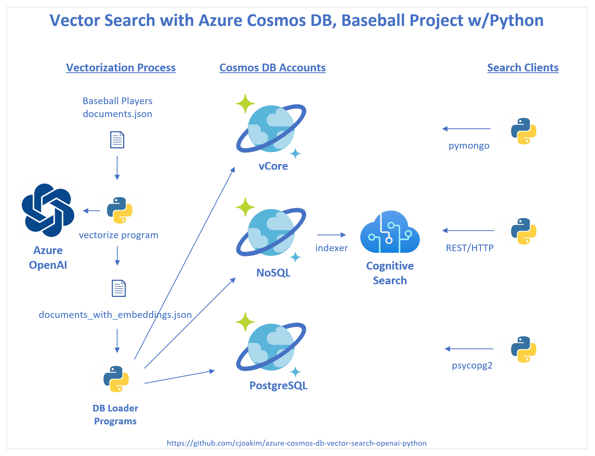

# azure-cosmos-db-vector-search-openai-python

## The Example Apps

This repo implements several sample **Azure Vector Search examples using Cosmos DB**, including:

- **Azure Cosmos DB for MongoDB vCore API**
- **Azure Cosmos DB NoSQL API with Azure Cognitive Search**
- **Azure Cosmos DB PostgreSQL API, with the pgvector extension**

Use can use this repo to run one, or two, or all three of these apps depending
on your interest.

## Architecture of this Project

    

---

## This Documentation

All documentation in this repository is intended to be **User Documentation**
so that you can successfully execute this set of demonstration apps.

The audience is Software Developers, Architects, or similar roles
who have an interest in Azure OpenAI, Azure Cosmos DB, and vector search.

**Code documentation** is beyond the scope of this project, but the code
should be understandable to Developers.

---

## The Dataset

One dataset, the **Sean Lahman Baseball Database** (see below), is used for all
of these example apps.  Baseball was chosen as the data domain for this project
because **the game has a very long history, and rich set of data and statistics.**
This "database" contains a large set of CSV files.  This repo uses only four 
of these files; see the data/seanhahman-baseballdatabank-2023.1/core/ directory.

The logic in the **data_wrangling** directory contains the logic to transform
the raw baseball CSV data into documents and rows with vectorized data (i.e. - embeddings)
using an **Azure OpenAI** PaaS service.

This repo contains file **data/wrangled/documents.json** which is the output of
the wrangling (i.e. - transformation) process.
But **you must use the provided code and scripts to add the OpenAI vectorized embedding values**
before loading this vectorized data into the database.

Once the data is vectorized, **the same vectorized data file is used for ALL THREE APPS**.
So, in short, you need to execute the vectorization process just once.

---

## The Business Problem

While other search techniques can answer **simple searches** like:

- Who hits home runs at a similar rate as Hank Aaron?
- Who steals bases at at a similar rate as Rickey Henderson?
- Who has a similar pitching ERA (earned run average) as Ron Guidry?

**This project instead seeks to answer this more complex question, using vector search:**

- **Who has a similar OVERALL PERFORMANCE PROFILE as player x?**

    

    Rickey Henderson (henderi01), MLB Hall of Fame Player, Statistical Unicorn

    

---

## The Project Implementation

The implementation programming language in this repo is **Python 3**;
it was developed with Python **3.11.1**. Python was chosen because it is a
widely-used language, has a low learning curve, is cross-platform, and
is considered to be the **primary programming language for data science**
at this time.

The project is executable on **Windows, macOS, and Linux** hosts.
Windows PowerShell (.ps1) scripts, and Bash (.sh) scripts for macOS and Linux
are provided in this repo.

**This project is intended for demonstration purposes, and also as a starting point for Azure customers to implement their own vector search applications in Azure.**

For users new to Python, please see the
[Python Notes](https://github.com/cjoakim/azure-cosmos-db-vector-search-openai-python/blob/main/docs/workstation_setup.md)
section of the workstation setup instructions.

---

## Project Links

- [Azure Provisioning](azure_provisioning.md)
- [Workstation Setup](workstation_setup.md)
- [Data Wrangling (optional)](data_wrangling.md)
- [Data Vectorization](data_vectorization.md)
- [Azure Cosmos DB vCore Mongo API searching](cosmos_vcore.md)
- [Azure Cosmos DB NoSQL API with Azure Cognitive Search searching](cosmos_nosql_and_cogsearch.md)
- [Azure Cosmos DB PostgreSQL API with pgvector](cosmos_pg_pgvector.md)

---

## Azure Links

### Azure OpenAI

- https://learn.microsoft.com/en-us/azure/ai-services/openai/overview
- https://platform.openai.com/docs/guides/embeddings

### Azure Cosmos DB vCore API

- https://learn.microsoft.com/en-us/azure/cosmos-db/mongodb/vcore/vector-search

### Azure Cosmos DB NoSQL API with Azure Cognitive Search

- https://learn.microsoft.com/en-us/azure/search/vector-search-overview
- https://learn.microsoft.com/en-us/azure/search/vector-search-how-to-query

### pgvector extension with Azure Cosmos DB PostgreSQL API

- https://learn.microsoft.com/en-us/azure/cosmos-db/postgresql/howto-use-pgvector
