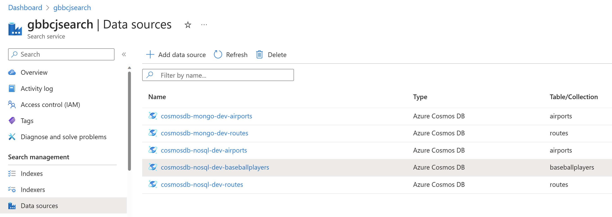
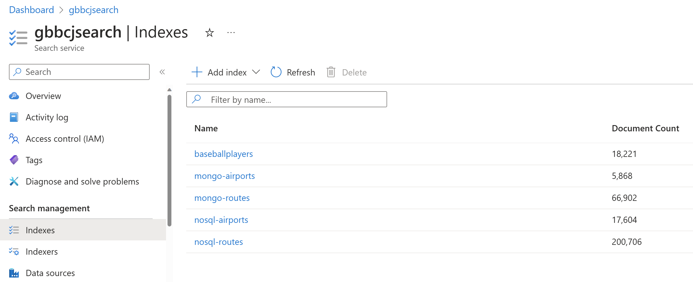
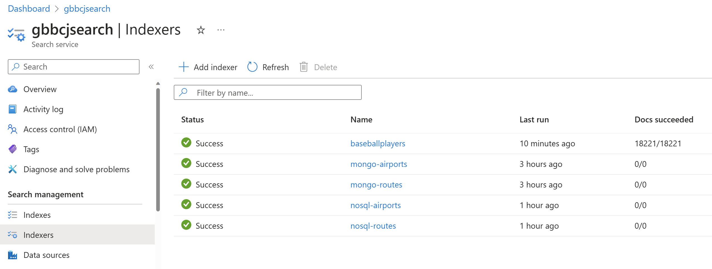

# Azure Cosmos DB NoSQL API with Azure Cognitive Search

## Documentation

Please refer to these Azure documentation pages.

### Azure Cosmos DB vCore API

- https://learn.microsoft.com/en-us/azure/cosmos-db/mongodb/vcore/vector-search

### Azure Cosmos DB NoSQL API with Azure Cognitive Search

- https://learn.microsoft.com/en-us/azure/search/vector-search-overview
- https://learn.microsoft.com/en-us/azure/search/vector-search-how-to-query

---

## Azure Cosmos DB NoSQL API

In the [Azure Provisioning](azure_provisioning.md) section of this project
we created your Cosmos DB NoSQL account and simply created the **dev** database,
with a container named **baseballplayers** which uses **/playerID** as the
partition key.

All we have to do now is load that container as follows:

```
> cd cosmos_nosql

> .\venv.ps1                  

> .\venv\Scripts\activate

> mkdir tmp

> python main.py load_nosql_baseballplayers
```

This **load_nosql_baseballplayers** process will take several minutes to run
depending on your computer and network speed. Over 18,000 documents will be
loaded into the database.

While the Cosmos DB NoSQL API supports SQL-based queries, it doesn't support
search natively.  However, it integrates very easily with **Azure Cognitive Search**.

---

## Azure Cognitive Search

In the [Azure Provisioning](azure_provisioning.md) section of this project
we simply created a **Cognitive Search** account with no additional configuration.

We'll now use the Azure Cognitive Search **REST API** to create a **Datasource**
for your Cosmos DB account, an **Index** that defines the attributes within a Cosmos DB
container to be indexed, and an **Indexer** which periodically reads the
Datasoure to populate the Index.  Once the Index is populated, we can query
it with the REST API.  Python code, using the [requests](https://pypi.org/project/requests/)
library, invokes the REST API via HTTPs.  Credentials are passed as HTTP headers.

### Configuring your Azure Cognitive Search

```
> cd cognitive_search

> .\venv.ps1                  

> .\venv\Scripts\activate

> mkdir tmp

> .\cogsearch_baseballplayers_create.ps1
```

The **cogsearch_baseballplayers_create.ps1** script will first delete indexer,
index, and datasource, then recreate them in the reverse order. 

The output will be simiar to the following:

```
(venv) PS ...\cognitive_search> .\cogsearch_baseballplayers_create.ps1
deleting output tmp/ files ...
============================================================
['cogsearch_main.py', 'display_config']
search_name:      gbbcjsearch
search_url:       https://gbbcjsearch.search.windows.net
search_admin_key: BZ2B... secret ...
search_query_key: bM63... secret ...
admin_headers:
{
  "Content-Type": "application/json",
  "api-key": "BZ2B... secret ..."
}
query_headers:
{
  "Content-Type": "application/json",
  "api-key": "bM63... secret ..."
}
============================================================
['cogsearch_main.py', 'delete_indexer', 'baseballplayers']
============================================================
['cogsearch_main.py', 'delete_index', 'baseballplayers']
============================================================
['cogsearch_main.py', 'delete_datasource', 'cosmosdb-nosql-dev-baseballplayers']
============================================================
['cogsearch_main.py', 'create_cosmos_nosql_datasource', 'AZURE_COSMOSDB_NOSQL_ACCT', 'AZURE_COSMOSDB_NOSQL_RO_KEY1', 'dev', 'baseballplayers']
file written: tmp/create_cosmos_nosql_datasource_dev_baseballplayers_1691615622.json
============================================================
['cogsearch_main.py', 'create_index', 'baseballplayers', 'baseballplayers_index.json']
file written: tmp/create_index_baseballplayers_1691615636.json
============================================================
['cogsearch_main.py', 'create_indexer', 'baseballplayers', 'baseballplayers_indexer.json']
file written: tmp/create_indexer_baseballplayers_1691615645.json
============================================================
['cogsearch_main.py', 'get_indexer_status', 'baseballplayers']
file written: tmp/get_indexer_status_1691615652.json
============================================================
['cogsearch_main.py', 'list_datasources']
file written: tmp/list_datasources_1691615659.json
============================================================
['cogsearch_main.py', 'list_indexes']
file written: tmp/list_indexes_1691615666.json
============================================================
['cogsearch_main.py', 'list_indexers']
file written: tmp/list_indexers_1691615673.json
done
```

You can look at the output files in the tmp/ directory to see the
results of each operation.  For example, file 
"tmp/create_indexer_baseballplayers_1691615645.json".
In this example 1691615645 is the execution epoch timestamp.

### Azure Portal

You can go to your Azure Cognitive Search account in Azure Portal to
**confirm that the **Datasource, Index, and Indexer** have been created.**
The following screen-shots show these.  These screen shots also some
airports and routes objects but these aren't part of this project.
The **baseballplayers** objects pertain to this project.

<p align="center">
    
</p>

---

<p align="center">
    
</p>

---

<p align="center">
    
</p>

Per this screen shot, the Indexer ran successfully and indexed all 18,221
documents in the Cosmos DB container.  On subsequent runs of the Indexer,
however, zero or few documents may be indexed because Azure Cognitive Search
only indexes the documents that have changed since the last run of the Indexer.

The **Indexer** used in this project is defined with this JSON document.
The **schedule** is defined to run every hour (PT1H) in this example.

```
{
  "name": "baseballplayers",
  "dataSourceName": "cosmosdb-nosql-dev-baseballplayers",
  "targetIndexName": "baseballplayers",
  "schedule": {
    "interval": "PT1H"
  }
}
```

### How Search is Implemented in this Project

The same approach is used here as in the Cosmos DB vCore and PostgreSQL API
apps in this project.  First, a lookup search (not a vector search) is
used to lookup the given playerID in the Index.  Then, if the lookup was
successful, the **embeddings** value of that search result are used
to execute a vector search for players similar to those embeddings.

Note that it is **Azure Cognitive Search that is searched**, not
the Cosmos DB source container.

### Executing Searches

Script **cogsearch_baseballplayers_searches.ps1** will execute 
vector searches for players like these players:

```
python cogsearch_main.py search_index baseballplayers aaronha01

python cogsearch_main.py vector_search_like baseballplayers aaronha01
python cogsearch_main.py vector_search_like baseballplayers jeterde01
python cogsearch_main.py vector_search_like baseballplayers henderi01
python cogsearch_main.py vector_search_like baseballplayers blombro01
python cogsearch_main.py vector_search_like baseballplayers guidrro01
python cogsearch_main.py vector_search_like baseballplayers rosepe01
```

#### Sample Output

Here's the output for just Hank Aaron (aaronha01).
The response data from Azure Cognitive Search is in JSON format.

```
{
  "@odata.context": "https://gbbcjsearch.search.windows.net/indexes('baseballplayers')/$metadata#docs(*)",
  "@odata.count": 10,
  "value": [
    {
      "@search.score": 1.0,
      "id": "b55efe79-8286-408a-8aa1-5b03c987fa5c",
      "playerID": "aaronha01",
      "nameFirst": "Hank",
      "nameLast": "Aaron",
      "primary_position": "RF"
    },
    {
      "@search.score": 1.0,
      "id": "5a7e203e-2b46-454e-b8c9-3f0163445219",
      "playerID": "dawsoan01",
      "nameFirst": "Andre",
      "nameLast": "Dawson",
      "primary_position": "RF"
    },
    {
      "@search.score": 1.0,
      "id": "433c8a00-b694-4779-97fa-4b979114a526",
      "playerID": "denorch01",
      "nameFirst": "Chris",
      "nameLast": "Denorfia",
      "primary_position": "RF"
    },
    {
      "@search.score": 1.0,
      "id": "5ff256e8-f68d-4016-98a7-f4ad766319a2",
      "playerID": "guerrvl01",
      "nameFirst": "Vladimir",
      "nameLast": "Guerrero",
      "primary_position": "RF"
    },
    {
      "@search.score": 1.0,
      "id": "365b27a0-4187-4e46-a42d-9f9922b881fa",
      "playerID": "kalinal01",
      "nameFirst": "Al",
      "nameLast": "Kaline",
      "primary_position": "RF"
    },
    {
      "@search.score": 1.0,
      "id": "ecb75456-7f61-4ae4-bf53-4e7ce5f658cf",
      "playerID": "puigya01",
      "nameFirst": "Yasiel",
      "nameLast": "Puig",
      "primary_position": "RF"
    },
    {
      "@search.score": 1.0,
      "id": "9858158a-5442-4df7-99f8-41e8d0f9f1d6",
      "playerID": "robinfr02",
      "nameFirst": "Frank",
      "nameLast": "Robinson",
      "primary_position": "RF"
    },
    {
      "@search.score": 1.0,
      "id": "fe2e9004-ef1a-4f63-8651-187508edd8f3",
      "playerID": "sheffga01",
      "nameFirst": "Gary",
      "nameLast": "Sheffield",
      "primary_position": "RF"
    },
    {
      "@search.score": 1.0,
      "id": "93621781-4d5b-4a15-96cd-883578939f3c",
      "playerID": "suzukic01",
      "nameFirst": "Ichiro",
      "nameLast": "Suzuki",
      "primary_position": "RF"
    },
    {
      "@search.score": 1.0,
      "id": "182d9ca5-034a-4365-9671-7c447b9767f7",
      "playerID": "winfida01",
      "nameFirst": "Dave",
      "nameLast": "Winfield",
      "primary_position": "RF"
    }
  ]
}
```

---

## Summary

- We didn't have to create verbose explicit queries with many attributes, and value ranges for these attributes
- We simply asked Azure Cognitive Search to "find me players like Hank Aaron"
- And the results are very accurate
