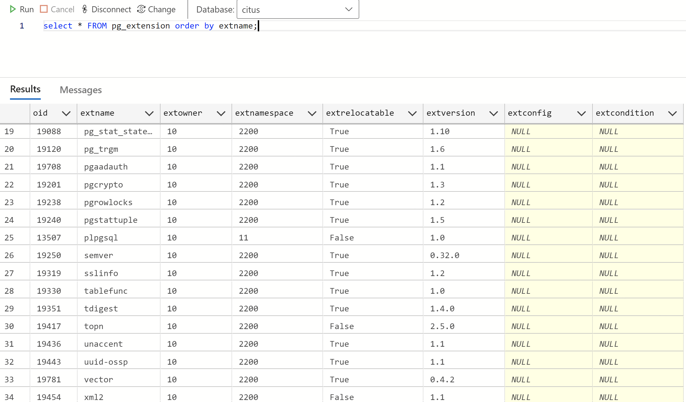
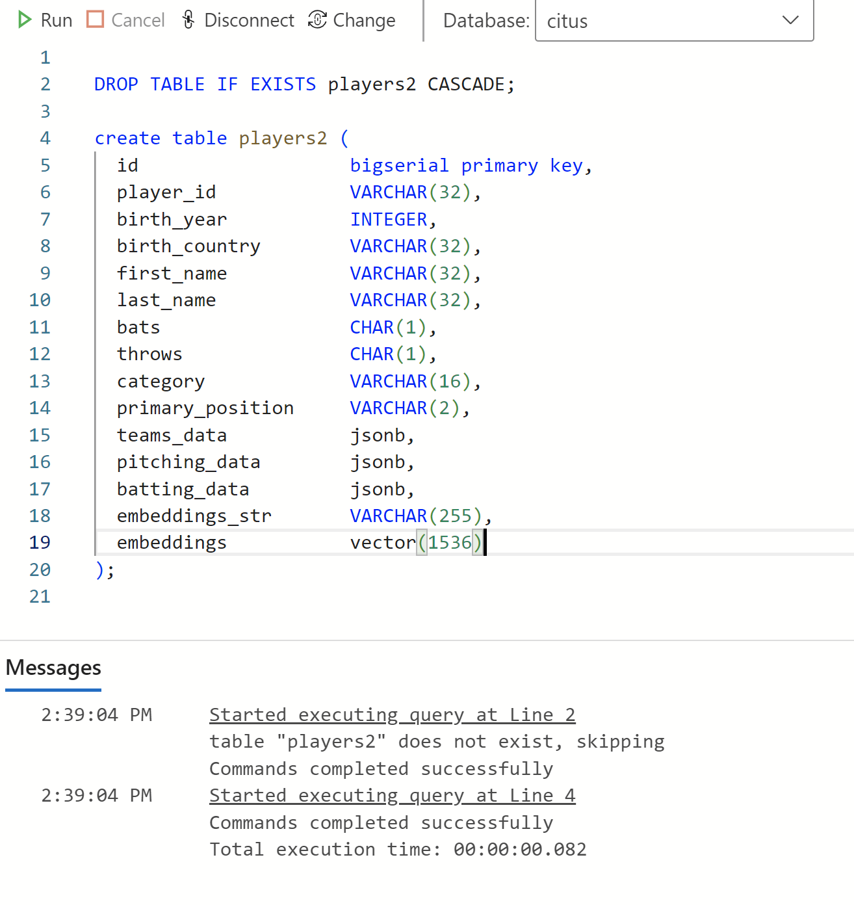

# Azure Cosmos DB PostgreSQL API with pgvector search

## Documentation

Please refer to this Azure documentation page.

- https://learn.microsoft.com/en-us/azure/cosmos-db/postgresql/howto-use-pgvector

## Add the pgvector extension

Open a client shell program (i.e. - Azure Data Studio) to your Cosmos DB PostgreSQL API
account, and execute the following statement:

```
SELECT CREATE_EXTENSION('vector');
```

Then, list the currently-installed extensions with this command.
You'll see that "vector" is now installed.  This is the PostgreSQL
extension that enables vector search.

[Cosmos DB supports many PostgreSQL extensions](https://learn.microsoft.com/en-us/azure/cosmos-db/postgresql/reference-extensions)

```
select * FROM pg_extension order by extname;
```

You'll see output like this that shows that the **vector** extension has been installed:

<p align="center">
    
</p>

## Create the table

Execute the following in your client shell program.  It will create
a table named **players** which has several columns.

The column named **embeddings** is for the vectorized data - the 
arrays of 1536 floating-point values you created earlier in section
[Data Vectorization](data_vectorization.md).

Note that three columns of datatype **jsonb** are in the table.
These currently aren't used in this project, but they will contain
the schemaless JSON values found in input file "data/wrangled/documents_with_embeddings.json".
This is a very interesting feature of Azure Cosmos DB PostgreSQL.
See https://www.postgresql.org/docs/current/datatype-json.html#JSON-INDEXING

```
DROP TABLE IF EXISTS players CASCADE;

create table players (
  id                   bigserial primary key,
  player_id            VARCHAR(32),
  birth_year           INTEGER,
  birth_country        VARCHAR(32),
  first_name           VARCHAR(32),
  last_name            VARCHAR(32),
  bats                 CHAR(1),
  throws               CHAR(1),
  category             VARCHAR(16),
  primary_position     VARCHAR(2),
  teams_data           jsonb,
  pitching_data        jsonb,
  batting_data         jsonb,
  embeddings_str       VARCHAR(255),
  embeddings           vector(1536)
);
```

### Output in ADS 

This screen-shots shows table "players2", but please use the name "players"
in your database.

<p align="center">
    
</p>

---

## Loading your Azure Cosmos DB PostgreSQL API table

Now that your Cosmos DB PostgreSQL API account has a database, a table,
and a vector column in that table, you can load that table as shown below.

```
> cd cosmos_pg

> .\venv.ps1                  

> .\venv\Scripts\activate

> mkdir tmp

> python main.py load_baseball_players cosmos citus
```

This **load_baseball_players** process will take several minutes to run
depending on your computer and network speed. Over 18,000 rows will be
loaded into the table.

After the load completes, go back to your shell program and execute
this query to count the rows.  The result should be 18221.

```
select count(*) from players;
```

## Using the psql client program

If you have **psql** installed on your computer, you can use it to
connect to your Azure Cosmos DB PostgreSQL API using your connection string -
the environment variables previously discussed here:
[Azure Provisioning](azure_provisioning.md).

```
(venv) PS ...\cosmos_pg> .\psql.ps1
```

Then, in the psql shell, you can execute the usual PostgreSQL commands
like this:

```
citus=> \d players
                                         Table "public.players"
      Column      |          Type          | Collation | Nullable |               Default
------------------+------------------------+-----------+----------+-------------------------------------
 id               | bigint                 |           | not null | nextval('players_id_seq'::regclass)
 player_id        | character varying(32)  |           |          |
 birth_year       | integer                |           |          |
 birth_country    | character varying(32)  |           |          |
 first_name       | character varying(32)  |           |          |
 last_name        | character varying(32)  |           |          |
 bats             | character(1)           |           |          |
 throws           | character(1)           |           |          |
 category         | character varying(16)  |           |          |
 primary_position | character varying(2)   |           |          |
 teams_data       | jsonb                  |           |          |
 pitching_data    | jsonb                  |           |          |
 batting_data     | jsonb                  |           |          |
 embeddings_str   | character varying(255) |           |          |
 embeddings       | vector(1536)           |           |          |
Indexes:
    "players_pkey" PRIMARY KEY, btree (id)

\q
```

## How Search is Implemented in this Project

As described previously in the 
[Azure Cosmos DB vCore Mongo API searching](cosmos_vcore.md)
section of this documentation, the approach taken in this repo is to first
query the table for a given **playerID**.  Then, based on the search result
for that player, use their **embedding value** to execute a vector search
against the entire table to find similar players.

The first SQL query looks like this:

```
select player_id, embeddings from players where player_id = '{player_id}'
```

The second SQL query looks like this:

```
select player_id, first_name, last_name, bats, throws, primary_position, batting_data
from players
order by embeddings <-> '[...]'
limit 10;
```

The second SQL query uses the **<->** operator (the **"distance operator"**),
to return the Euclidean distance (L2 distance) between the given vector
and the vectors in the table.  The query finds the closest 10 rows
based on vector value.

## Searching your Azure Cosmos DB PostgreSQL API table

You can execute the Python program as shown below to execute a 
vector search to find players similar to playerID aaronha01 (Hank Aaron).

```
(venv) PS ...\cosmos_pg> python main.py search_similar_baseball_players cosmos citus aaronha01

search_similar_baseball_players: cosmos citus aaronha01
Connection pool created
Connection created
result 1: aaronha01 Hank Aaron RF
result 2: winfida01 Dave Winfield RF
result 3: kalinal01 Al Kaline RF
result 4: robinfr02 Frank Robinson RF
result 5: dawsoan01 Andre Dawson RF
result 6: guerrvl01 Vladimir Guerrero RF
result 7: garciad02 Adolis Garcia RF
result 8: suzukic01 Ichiro Suzuki RF
result 9: staubru01 Rusty Staub RF
result 10: ottme01 Mel Ott RF
Connection closed
```

## Summary

- We didn't have to create verbose explicit SQL queries with many attributes, and value ranges for these attributes
- We simply asked the database to "find me players like Hank Aaron"
- And the results are very accurate
