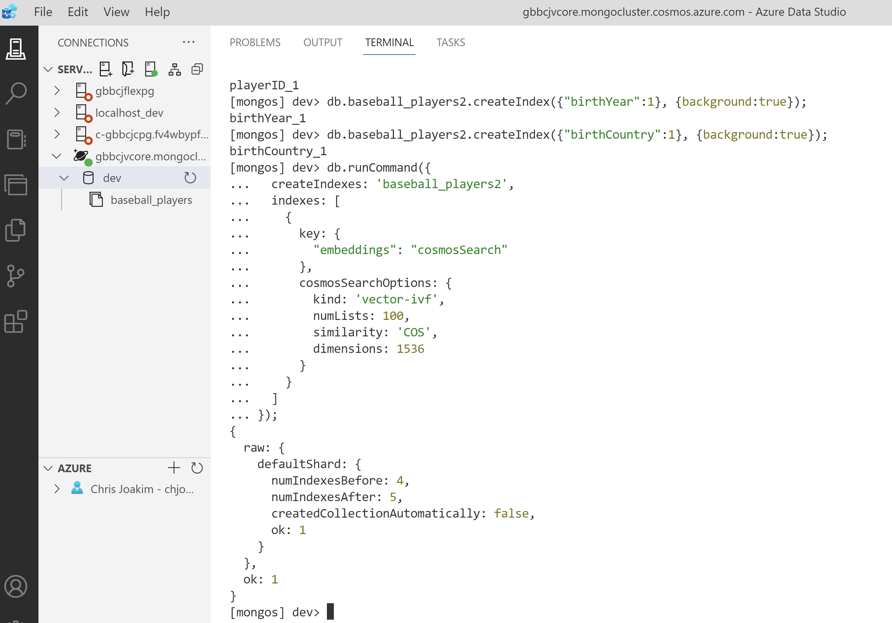
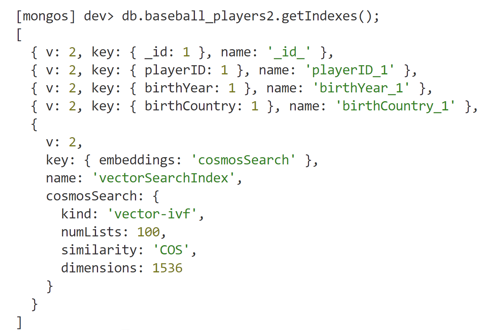

# Azure Cosmos DB vCore Mongo API with vector search

## Documentation

Please refer to these Azure documentation pages.

- https://learn.microsoft.com/en-us/azure/search/vector-search-overview
- https://learn.microsoft.com/en-us/azure/search/vector-search-how-to-query

---

## Configuring your Cosmos DB vCore Mongo API database

Use your **mongo shell** program of choice (Azure Data Studio, mongosh, Studio 3T, etc.)
and create a database name.  **Azure Data Studio is recommended**, and the following
screen-shots use it.

### Mongo Shell Commands

Execute these commands individually, in sequence.  Each command ends with a semicolon (;).

These commands will create the **baseball_players** collection in the **dev** database.
Indexes will be added to the collection, including the **vectorSearchIndex**
on attribute **embeddings** which contains your vectorized data.

```
use dev;

db.baseball_players.getIndexes();

db.baseball_players.createIndex({"playerID":1}, {background:true});

db.baseball_players.createIndex({"birthYear":1}, {background:true});

db.baseball_players.createIndex({"birthCountry":1}, {background:true});

db.baseball_players.dropIndex('vectorSearchIndex');

db.runCommand({
  createIndexes: 'baseball_players',
  indexes: [
    {
      name: 'vectorSearchIndex',
      key: {
        "embeddings": "cosmosSearch"
      },
      cosmosSearchOptions: {
        kind: 'vector-ivf',
        numLists: 19,
        similarity: 'COS',
        dimensions: 1536
      }
    }
  ]
});

db.baseball_players.getIndexes();
```

These commands exist as file **cosmos_vcore/mongo/baseball_players_create_indexes.txt**
in the repo.

**Please pay particular attention to the configuration of your vector index**
as described here: https://learn.microsoft.com/en-us/azure/cosmos-db/mongodb/vcore/vector-search.

### Screen-shots of Azure Data Studio

These screen-shots show collection "baseball_players2", but please use the name "baseball_players"
in your database.

<p align="center">
    
</p>

---

<p align="center">
    
</p>

---

## Loading your Cosmos DB vCore Mongo API Account

Now that your vCore account has a database, a container, and a vector search
index in that container, now we can load that container as described here.

```
> cd cosmos_vcore

> .\venv.ps1                  

> .\venv\Scripts\activate

> mkdir tmp

> python main.py load_vcore_baseball_players
```

This **load_vcore_baseball_players** process will take several minutes to run
depending on your computer and network speed. Over 18,000 documents will be
loaded into the database.

After the load process completes, go back to your mongo shell program and
query the number of documents with the following command.  In this example
18221 is the returned count.

```
[mongos] dev> db.baseball_players.countDocuments();
18221
```

Next, query the Hank Aaron document to ensure that it exists in your container:

```
[mongos] dev> db.baseball_players.find({"playerID": "aaronha01"});
```

## Searching your vCore Mongo API Account

Scripts **searches.ps1** and **searches.sh** execute searches
for players like these players:

```
python main.py search_player_like aaronha01
python main.py search_player_like jeterde01
python main.py search_player_like henderi01
python main.py search_player_like blombro01
python main.py search_player_like guidrro01
python main.py search_player_like rosepe01
python main.py random_player_search
```

Values like "jeterde01" (Derek Jeter) are **playerID** values in the database.

### How Search is Implemented in this Project

The logic in the Python code first does a lookup of the given playerID,
such as "jeterde01".  That found document will contain an **embeddings**
value - the array of floating-point values which was created in the
previously described [Data Vectorization](data_vectorization.md) process.

The value of those **embeddings** for the playerID are then used to
execute a **vector search** to find players like the given playerID.
The search results are iterated and displayed,
and a tmp file is written which contains all of the search results - in 
the case that you want to do a deep-dive analysis of the results.
For example, file "tmp/search_player_like_jeterde01.json".

### Aggregation Pipeline

Vector Search queries with the Azure Cosmos DB vCore Mongo API are executed
with an **aggregation pipeline** that looks like the following:

```
[
  {
    "$search": {
      "cosmosSearch": {
        "vector": [
          -0.03235216066241264,
          0.016530998051166534,
          -0.004801633767783642,
          0.01107754372060299,

          ...

          0.007152967154979706,
          -0.005310122389346361,
          -0.010333580896258354,
          -0.03164232522249222,
          -0.006484082899987698
        ],
        "path": "embeddings",
        "k": 10
      },
      "returnStoredSource": true
    }
  }
]
```

The **k** in the pipeline is the maximum number of search documents requested.
The value of **vector** are the embeddings value of the given playerID,
and **"path": "embeddings"** means search the **embeddings** attribute values
for the documents in the collection.

The pipeline is then executed with this single line of code, where m
is an instance of class Mongo in this repo (see file cosmos_vcore/pysrc/mongobundle.py)
in the repo.

```
    results = m.aggregate(pipeline)
```

### Alternative Search Implementations

In many other OpenAI vector search examples you may see, different logic
is used.  They often compute the value of the embeddings at runtime, via the
OpenAI SDK, and then use that returned value to execute the search.

Either approach is valid; it depends on your search use-cases.
The use-case implemented in this repo is to **find similar players**.

### Search Results

**The search results for Hank Aaron (aaronha01)** look very reasonable
as they are all right fielders (RF) who are known as "power hitters",
and had long careers.

Note that the first search result for each player is that same player
as the search embeddings are equivalent to the result embedding.


### Example Output

```
(venv) PS ...\cosmos_vcore> .\searches.ps1
===
searching for: aaronha01
found player: aaronha01 Hank Aaron RF
result 1: aaronha01 Hank Aaron RF
result 2: kalinal01 Al Kaline RF
result 3: dawsoan01 Andre Dawson RF
result 4: winfida01 Dave Winfield RF
result 5: robinfr02 Frank Robinson RF
result 6: guerrvl01 Vladimir Guerrero RF
result 7: puigya01 Yasiel Puig RF
result 8: suzukic01 Ichiro Suzuki RF
result 9: sheffga01 Gary Sheffield RF
result 10: denorch01 Chris Denorfia RF
result_count: 10
file written: tmp/vcore_search_player_like_aaronha01.json
===
searching for: jeterde01
found player: jeterde01 Derek Jeter SS
result 1: jeterde01 Derek Jeter SS
result 2: rodrial01 Alex Rodriguez SS
result 3: maranra01 Rabbit Maranville SS
result 4: yountro01 Robin Yount SS
result 5: conceda01 Dave Concepcion SS
result 6: castrst01 Starlin Castro SS
result 7: dejesiv01 Ivan de Jesus SS
result 8: vizquom01 Omar Vizquel SS
result 9: garcino01 Nomar Garciaparra SS
result 10: francju01 Julio Franco SS
result_count: 10
file written: tmp/vcore_search_player_like_jeterde01.json
===
searching for: henderi01
found player: henderi01 Rickey Henderson LF
result 1: henderi01 Rickey Henderson LF
result 2: bondsba01 Barry Bonds LF
result 3: quinnma01 Mark Quinn LF
result 4: drakede01 Delos Drake LF
result 5: ibanera01 Raul Ibanez LF
result 6: cartejo01 Joe Carter LF
result 7: mooredy01 Dylan Moore LF
result 8: frazilo01 Lou Frazier LF
result 9: carreez01 Ezequiel Carrera LF
result 10: jollesm01 Smead Jolley LF
result_count: 10
file written: tmp/vcore_search_player_like_henderi01.json
===
searching for: blombro01
found player: blombro01 Ron Blomberg DH
result 1: blombro01 Ron Blomberg DH
result 2: adamsgl01 Glenn Adams DH
result 3: alvaryo01 Yordan Alvarez DH
result 4: lecroma01 Matt LeCroy DH
result 5: sheetla01 Larry Sheets DH
result 6: vogelda01 Dan Vogelbach DH
result 7: hamelbo01 Bob Hamelin DH
result 8: phelpjo01 Josh Phelps DH
result 9: velezot01 Otto Velez DH
result 10: giambje01 Jeremy Giambi DH
result_count: 10
file written: tmp/vcore_search_player_like_blombro01.json
===
searching for: guidrro01
found player: guidrro01 Ron Guidry P
result 1: guidrro01 Ron Guidry P
result 2: mcwilla01 Larry McWilliams P
result 3: hurstbr01 Bruce Hurst P
result 4: brettke01 Ken Brett P
result 5: underto01 Tom Underwood P
result 6: heatone01 Neal Heaton P
result 7: mizelvi01 Vinegar Bend Mizell P
result 8: lushjo01 Johnny Lush P
result 9: daalom01 Omar Daal P
result 10: richepe01 Pete Richert P
result_count: 10
file written: tmp/vcore_search_player_like_guidrro01.json
===
searching for: rosepe01
found player: rosepe01 Pete Rose 1B
result 1: rosepe01 Pete Rose 1B
result 2: jeffegr01 Gregg Jefferies 1B
result 3: mcganda01 Dan McGann 1B
result 4: clenddo01 Donn Clendenon 1B
result 5: murraed02 Eddie Murray 1B
result 6: milledo02 Dots Miller 1B
result 7: palmera01 Rafael Palmeiro 1B
result 8: carewro01 Rod Carew 1B
result 9: hosmeer01 Eric Hosmer 1B
result 10: hoppjo01 Johnny Hopp 1B
result_count: 10
file written: tmp/vcore_search_player_like_rosepe01.json

...
```

--- 

## Summary

- We didn't have to create verbose explicit queries with many attributes, and value ranges for these attributes
- We simply asked the database to "find me players like Hank Aaron"
- And the results are very relevant
