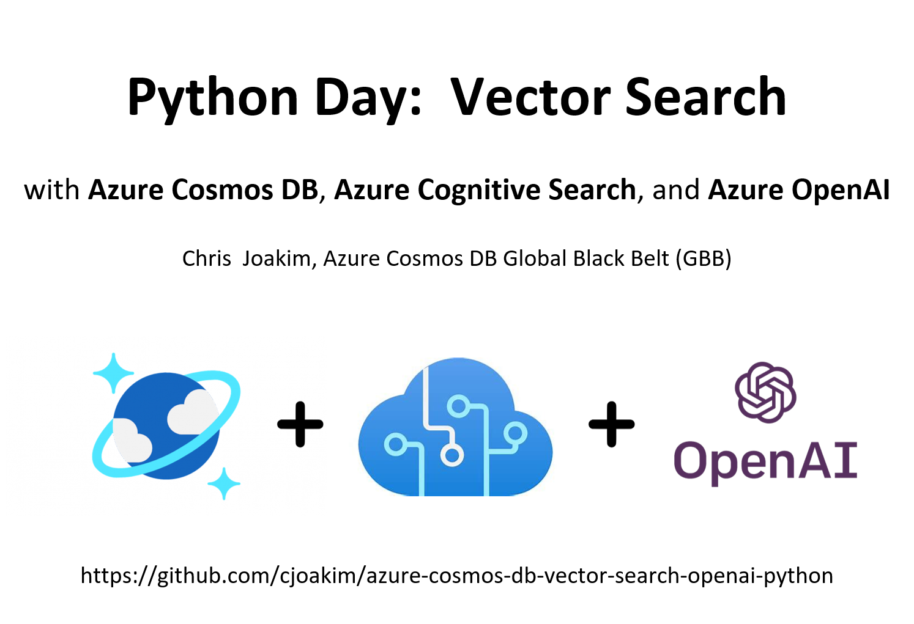
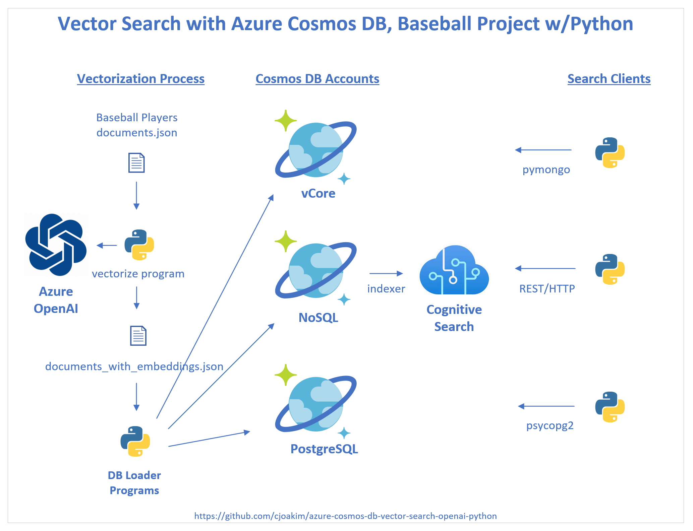
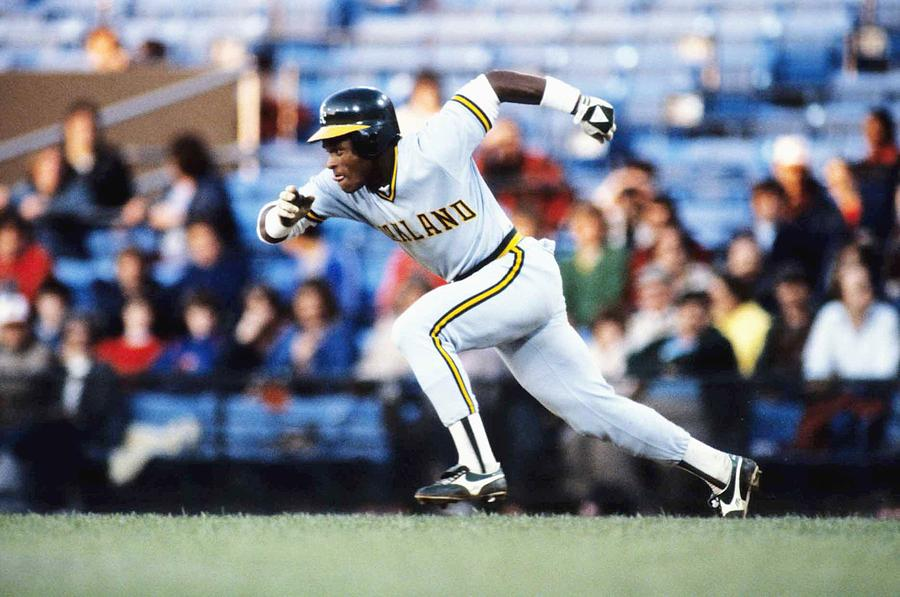
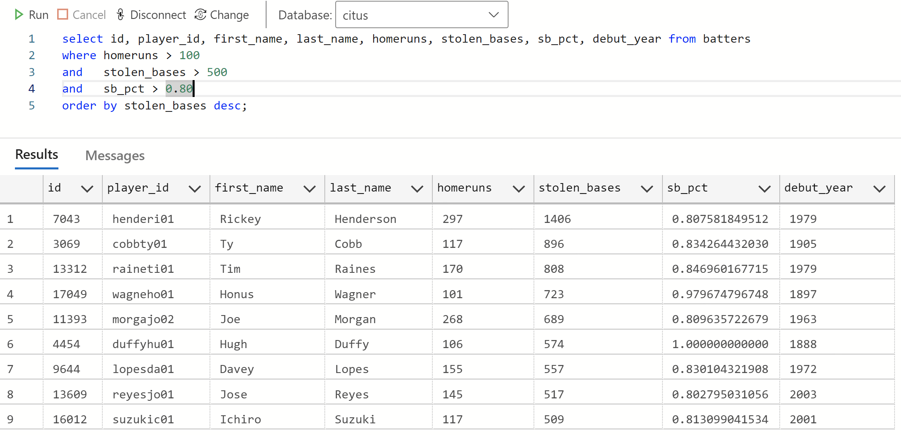

<p align="center">
    
</p>

---

## About Chris

- Career Path
  - Non-IT --> Software Developer --> Azure Cloud Solution Architect --> Azure NoSQL GBB
- Primary Programming Languages Path
  - COBOL --> Smalltalk --> Java --> Ruby (RoR) --> Node.js (MEAN) --> Java --> **Python**
- Databases Path
  - IMS/DB (Hierarchical) --> DB2/Oracle/Sybase/MySQL/PostgreSQL --> **MongoDB (2009) --> Cosmos DB**
- GitHub
  - https://github.com/cjoakim
- PyPi Packages
  - [m26](https://pypi.org/project/m26/), [ggps](https://pypi.org/project/ggps/), [gdg](https://pypi.org/project/gdg/)

[pylint](https://pypi.org/project/pylint/) often hurts my feelings.  

Why show this timeline?
Have a [growth Mindset; always be learning](https://www.linkedin.com/pulse/satya-nadella-growth-mindsets-learn-it-all-does-better-jessi-hempel/)

### Why do I use Python now?

- Simple, pragmatic, universally used/understood, great libraries, cross-platform
- **App Dev**: console apps, web apps, Docker, ACI, Functions
- **Data Science**: Spark (Synapse), ML/AML/AI... and data wrangling
  - It's currently, IMO, the defacto "Programming Language of Data Science"

---

## This Presentation

- **Vector Search in Microsoft Azure** with:

  - [Azure OpenAI](https://learn.microsoft.com/en-us/azure/ai-services/openai/)
  - [Azure Cosmos DB NoSQL API](https://learn.microsoft.com/en-us/azure/cosmos-db/nosql/)
  - [Azure Cognitive Search](https://learn.microsoft.com/en-us/azure/search/)
  - [The Sean Lahman Baseball Database](http://seanlahman.com/download-baseball-database/) (CSV files)

### Presentation Outline

  - [Part 1 - Concepts](#part1)
  - [Part 2 - Implementation](#part2)

### Architecture of this Project

<p align="center">
    
</p>

For this **Python Day presentation**, I'll cover the middle solution in the diagram.

---

# <a name="part1"> Part 1 - Concepts

## What is Vectorization?

In this context, **vectorization** is the process of converting text data into vectors,
which are **one-dimensional arrays of scalar values**.

Think of them as a **numpy array of floats**.

These vectors are called **embeddings** in OpenAI.

The **OpenAI SDK** contains the functionality to produce a vector, or an embedding, from text data.

### What does a Vector, or Embedding, look like?

This repo uses **OpenAI embeddings** which are **an array of 1536 floating-point values**.

```
[
    0.002035311423242092,
    -0.0016240125987678766,
    -0.00955343060195446,
    0.019685856997966766,
    -0.037366412580013275,
    0.02373882755637169,
    -0.016621416434645653,
    -0.006778487470000982,
    -0.031858891248703,
    -0.028865059837698936
    ...
    0.01938929781317711,
    -0.007039741612970829,
    0.0302207563072443,
    -0.005779366474598646,
    0.010683178901672363,
    0.00484026363119483,
    0.018556108698248863,
    -0.01864084042608738,
    -0.013634645380079746,
    -0.007526945322751999
]
```

## What is Vector Search?

- Searching a database, or search-engine, using vectors
- A vector is passed in as the **query criteria**
- The DB/engine matches rows/documents **based on the given vector column/attribute in the DB**

### Can I use both standard search and vector search in my Azure Search Engine*?

Yes.  But with different search syntax and parameters.

* = Azure Cognitive Search, Cosmos DB Mongo vCore, Cosmos DB PostgreSQL

### Use-Cases for Vector Search

- Find images that are similar to a given image based on their visual content and style
- Find documents that are similar to a given document based on their topic and sentiment
- Find products that are similar to a given product based on their features and ratings

In short, many use-cases.

But, IMO, it doesn't replace standard search.  It augments it.

---

## What is Azure OpenAI, and why use it here?

> Azure OpenAI Service provides REST API access to OpenAI's powerful language models
> including the GPT-4, GPT-35-Turbo, and Embeddings model series. 
>
> These models can be easily adapted to your specific task including but not limited
> to content generation, summarization, semantic search, and natural language to code
> translation.
>
> Users can access the service through REST APIs, Python SDK, or our
> web-based interface in the Azure OpenAI Studio.

Note: This presentation isn't about the **generative AI** functionality available in OpenAI.
But we'll use OpenAI to vectorize our data.

See [Azure OpenAI](https://learn.microsoft.com/en-us/azure/ai-services/openai/).

---

## What's the Business Problem we're trying to solve?

While other search techniques can answer **simple searches** like:

- Who hits home runs at a similar rate as Hank Aaron?
- Who steals bases at at a similar rate as Rickey Henderson?
- Who has a similar pitching ERA (earned run average) as Ron Guidry?

**This project instead seeks to answer this more complex question, using vector search:**

- **Who has a similar OVERALL PERFORMANCE PROFILE as player x?**

This type of search is more nuanced and subtle, but **can yield more relevant search results**.

--- 

## Example Player: Rickey Henderson - Hall of Fame, Statistical Unicorn

<p align="center">
    
</p>

You can try to use a simplistic query (this example is SQL in Azure Cosmos DB PostgreSQL API)
to identify similar players.

But the **WHERE clause only contains three attributes** ... it's not a **"full-spectrum"** query.

<p align="center">
    
</p>

In the vector query search below (bottom of page)
**we'll simply ask instead: find me players like Rickey Henderson!**.

#### But what if you're not in the baseball business?

This vector search app is just an example; it's easily modifiable for your use-cases.

---

# <a name="part2"> Part 2 - Implementation

## Step 1: Data Wrangling

- The data started as CSV from the Sean Lahman Baseball Database
- CSV rows were transformed into JSON documents
- JSON documents augmented with calculations
- JSON documents augmented with a **embeddings_str** value for vectorization
- See the [Data Wrangling](data_wrangling.md) page for details

### Example Document for Hank Aaron 

```
  {
    "playerID": "aaronha01",
    "birthYear": 1934,
    "birthCountry": "USA",
    "deathYear": "2021.0",
    "nameFirst": "Hank",
    "nameLast": "Aaron",
    "weight": 180,
    "height": 72,
    "bats": "R",
    "throws": "R",
    "debut": "1954-04-13",
    "finalGame": "1976-10-03",
    "teams": {
      "total_games": 3298,
      "teams": {
        "ML1": 1806,
        "ATL": 1270,
        "ML4": 222
      },
      "primary_team": "ML1"
    },
    "primary_position": "RF",
    "batting": {
      "G": "3298",
      "AB": "12364",
      "R": "2174",
      "H": "3771",
      "2B": "624",
      "3B": "98",
      "HR": "755",
      "RBI": "2297.0",
      "SB": "240.0",
      "CS": "73.0",
      "BB": "1402",
      "SO": "1383.0",
      "IBB": "293.0",
      "HBP": "32.0",
      "SF": "121.0",
      "calculated": {
        "runs_per_ab": 0.17583306373341961,
        "batting_avg": 0.30499838240051763,
        "2b_avg": 0.050469103849886766,
        "3b_avg": 0.007926237463604012,
        "hr_avg": 0.06106438045939825,
        "rbi_avg": 0.18578130054998382,
        "bb_avg": 0.11339372371400841,
        "so_avg": 0.11185700420575866,
        "ibb_avg": 0.023697832416693626,
        "hbp_avg": 0.002588159171789065
      }
    },
    "category": "fielder",
    "debut_year": 1954,
    "final_year": 1976,
    "embeddings_str": "fielder primary_position_rf total_games_3298 bats_r throws_r hits_3771 hr_755 batting_avg_305 runs_per_ab_176 2b_avg_50 3b_avg_8 hr_avg_61 rbi_avg_186 bb_avg_113 so_avg_112 ibb_avg_24 hbp_avg_3"
  }
```

Here's an **embeddings_str text value** in an easier to read format.
This text value is passed to OpenAI to be "vectorized".

```
fielder primary_position_rf total_games_3298 bats_r throws_r hits_3771 hr_755
batting_avg_305 runs_per_ab_176 2b_avg_50 3b_avg_8 hr_avg_61 rbi_avg_186
bb_avg_113 so_avg_112 ibb_avg_24 hbp_avg_3
```

I used the approach of creating **binned-text values** in the embeddings_str.

For example, a batting average of **0.30499838240051763** becomes **"batting_avg_305"**.

A common example of this is **T-shirt sizes** - "S", "M", "L", "XL".

See [Binning in Azure Machine Learning](https://learn.microsoft.com/en-us/azure/machine-learning/component-reference/group-data-into-bins?view=azureml-api-2)

### Sidebar: Machine Learning "Features" vs Text Words

Since OpenAI embeddings calculation is based on **text**, the binned-text approach is used here.

In Maching Learning, one instead typically uses normalized numeric "features".

---

## Step 2: Vectorization

The code required to do this is quite simple, thanks to the **OpenAI SDK** at PyPI.

#### requirements.txt

```
openai
```

#### Python Code

```
from openai.embeddings_utils import get_embedding
from openai.openai_object import OpenAIObject

...

# Configure the openai client library
openai.api_base    = opts['url']   # <-- value from an environment variable, Azure Key Vault, etc
openai.api_key     = opts['key']   # <-- value from an environment variable, Azure Key Vault, etc
openai.api_type    = 'azure'
openai.api_version = '2023-05-15'  # '2022-06-01-preview' '2023-05-15'


# Ask the OpenAI SDK to calculate and return the embedding value
e = openai.Embedding.create(input=[text], engine=self.embedding_model)

return e['data'][0]['embedding']  # returns a list of 1536 floats
```

See class OpenAIClient in the repo for the full code; my reusable client module.

---

## Step 3: Loading the Azure Cosmos DB NoSQL API container

It's just a regular Cosmos DB container; no special indexing or required attributes.

#### requirements.txt

```
azure-cosmos
```

#### Python Code

```
from azure.cosmos import cosmos_client
from azure.cosmos import diagnostics
from azure.cosmos import exceptions

...

class Cosmos():
    """
    This class is used to access a Cosmos DB NoSQL API account.
    """
    def __init__(self, opts):
        self._dbname = None
        self._dbproxy = None
        self._ctrproxy = None
        self._cname = None
        self.reset_record_diagnostics()
        url = opts['url']
        key = opts['key']
        if 'enable_query_metrics' in opts.keys():
            self._query_metrics = True
        else:
            self._query_metrics = False
        self._client = cosmos_client.CosmosClient(url, {'masterKey': key})   <--- SDK client

...

    # main.py
    # Load the Cosmos DB container with the JSON documents which contain the embeddings array

    def load_nosql_baseballplayers():

        # Connect to Cosmos DB, select database, select container
        opts = dict()
        opts['url'] = Env.var('AZURE_COSMOSDB_NOSQL_URI')
        opts['key'] = Env.var('AZURE_COSMOSDB_NOSQL_RW_KEY1')
        c = Cosmos(opts)
        c.set_db('dev')
        c.set_container('baseballplayers')

        # Read the pre-wrangled documents
        documents = FS.read_json(wrangled_embeddings_file())
        player_ids = sorted(documents.keys())

        # Iterate and load Cosmos DB
        for idx, pid in enumerate(player_ids):
            try:
                doc = documents[pid]
                embeddings = doc['embeddings']
                if idx < 100_000:
                    if len(embeddings) == EXPECTED_EMBEDDINGS_ARRAY_LENGTH:  # 1536
                        doc['id'] = str(uuid.uuid4()) 
                        result = c.upsert_doc(doc)           <--- insert/update the doc
            except Exception as e:
                print(f"Exception on doc: {idx} {doc}")
                print(str(e))
                print(traceback.format_exc())
```

See class Cosmos in the repo for the full code; my "DAO" for Cosmos DB NoSQL.
File cosmos_nosql/pysrc/nosqlbundle.py.

---

## Step 4: Configuring Azure Cognitive Search

A full coverage of this is beyond the scope for this brief presentation.

In short, Azure Cognitive Search has a **beautiful and easy to use**
[REST API](https://learn.microsoft.com/en-us/rest/api/searchservice/).

With the REST API these key objects are created - **Datasource**, **Index**, and **Indexer**.
JSON payloads are used to define these objects.

- **Datasource** - defines where the source data is (i.e. - the Cosmos DB account, database, and container)
- **Index** - defines what document attributes to index and make searchable
- **Indexer** - associates a Datasource to an Index, with a schedule

See [Azure Cognitive Search](https://learn.microsoft.com/en-us/azure/search/)
for more information on these.

This repo uses the **Python requests library** to invoke the REST API via HTTPs.

### Sidebar: Why is it called "Cognitive Search"?

In addition to search functionality, Azure Cognitive Search offers 
[AI Enrichment](https://learn.microsoft.com/en-us/azure/search/cognitive-search-concept-intro)
functionality, by working with [Azure Cognitive Services](https://azure.microsoft.com/en-ca/products/cognitive-services).

For example:
- Ingest and "crack" PDF and Word documents
- Extract and identify the images
- Extract the text from the images
- Identify the key words in the text.
- Recognize the language and translate the text into another language
- Make the "enriched" content searchable

Azure Cognitive Services has a nice 
[Python SDK](https://learn.microsoft.com/en-us/python/api/overview/azure/cognitive-services?view=azure-python).

### Define the embeddings attribute in the Index

```
{
  "name": "baseballplayers",
  "fields": [
    {
      "name": "id",
      "key": "true",
      "type": "Edm.String",
      "searchable": "true",
      "filterable": "true",
      "sortable": "true",
      "facetable": "true"
    },
    {
      "name": "playerID",
      "key": "false",
      "type": "Edm.String",
      "searchable": "true",
      "filterable": "true",
      "sortable": "true",
      "facetable": "true"
    },
    {
      "name": "birthYear",
      "type": "Edm.Int32",
      "key": "false",
      "searchable": "false",
      "filterable": "true",
      "sortable": "true",
      "facetable": "true"
    },
    {
      "name": "birthCountry",
      "type": "Edm.String",
      "searchable": "true",
      "filterable": "true",
      "sortable": "true",
      "facetable": "true"
    },

    ... 

    {
      "name": "embeddings",
      "type": "Collection(Edm.Single)",
      "searchable": true,
      "retrievable": true,
      "dimensions": 1536,
      "vectorSearchConfiguration": "vectorConfig"
    }
  ],
  "vectorSearch": {
    "algorithmConfigurations": [
        {
            "name": "vectorConfig",
            "kind": "hnsw"
        }
    ]
  }
}
```

Once the Indexer is created, it will read the documents from Cosmos DB to
populate the search Index.

See the [full documentation in this repo](cosmos_nosql_and_cogsearch.md).

---

## Step 5: Excuting Vector Searches vs Azure Cognitive Search

### Initial Simple Search

First search the index for the target player (i.e. - Rickey Henderson)
to get their **embeddings value**.  Then use that value for the follow-up
vector search.

#### Alternative workflow

Given user search criteria, invoke the OpenAI embeddings API with those values
then use the returned embeddings in the follow-up vector search.


### The Vector Search JSON Request looks like this

``` 
{
  "count": "true",
  "select": "id,playerID,nameFirst,nameLast,primary_position",
  "orderby": "playerID",
  "vectors": [
    {
      "value": [
        -0.028514497,
        0.024909372,
        -0.0064178025,
        
        ...

        -0.014093998,
        -0.026895592,
        -0.0070129884
      ],
      "fields": "embeddings",
      "k": 10
    }
  ]
}
```

### Search from the command line for players like Rickey Henderson (henderi01)

```
(venv) PS ...\cognitive_search> python cogsearch_main.py vector_search_like baseballplayers henderi01

...

{
  "@odata.context": "https://gbbcjsearch.search.windows.net/indexes('baseballplayers')/$metadata#docs(*)",
  "@odata.count": 10,
  "value": [
    {
      "@search.score": 1.0,
      "id": "e4cc38fd-18c8-4418-8841-98a1403f5ef1",
      "playerID": "bondsba01",
      "nameFirst": "Barry",
      "nameLast": "Bonds",
      "primary_position": "LF"
    },
    {
      "@search.score": 1.0,
      "id": "c9867b7b-8c34-4e95-a672-16f1bdb393cf",
      "playerID": "brocklo01",
      "nameFirst": "Lou",
      "nameLast": "Brock",
      "primary_position": "LF"
    },
    {
      "@search.score": 1.0,
      "id": "dff54db9-24c5-42f4-9713-edee804001aa",
      "playerID": "burkeje01",
      "nameFirst": "Jesse",
      "nameLast": "Burkett",
      "primary_position": "LF"
    },
    {
      "@search.score": 1.0,
      "id": "a12910e7-9542-4c59-a767-4ebb3fddc463",
      "playerID": "henderi01",
      "nameFirst": "Rickey",
      "nameLast": "Henderson",
      "primary_position": "LF"
    },
    {
      "@search.score": 1.0,
      "id": "949d799f-c8e9-4ee0-a105-91c5f795af18",
      "playerID": "mageesh01",
      "nameFirst": "Sherry",
      "nameLast": "Magee",
      "primary_position": "LF"
    },
    {
      "@search.score": 1.0,
      "id": "b0c9c139-eec9-4a5a-9d95-1dfa2c80859d",
      "playerID": "meusebo01",
      "nameFirst": "Bob",
      "nameLast": "Meusel",
      "primary_position": "LF"
    },
    {
      "@search.score": 1.0,
      "id": "f1bd535f-f16c-4353-9e2d-338537064404",
      "playerID": "quinnma01",
      "nameFirst": "Mark",
      "nameLast": "Quinn",
      "primary_position": "LF"
    },

```

These search results are more relevant than the simple SQL query as they are
based on **all** of the attributes for the baseball players.

Rickey Henderson, a prolific base stealer as well as power hitter,
thus matches both Barry Bonds (power hitter) and Lou Brock (base stealer).

### Links/References

- https://learn.microsoft.com/en-us/azure/search/vector-search-overview
- https://learn.microsoft.com/en-us/azure/search/vector-search-how-to-query?tabs=portal-vector-query
- File cognitive_search/cogsearch_baseballplayers_searches.ps1 in the repo

---

## Confessions of a Python Developer

You might be asking what are these **xxxbundle.py** modules are in the repo?!

To achieve agile **code reuse** across my many demo repos, I have a standard
core codebase in a private repo.  I develop and test the reusable classes there,
then **bundle** them into function-specific single python modules for use
in my implementation repos.  For example **aibundle.py** and **nosqlbundle.py**.

Since I do about half of my Python programming in Spark/PySpark (in Synapse and AML)
this approach works well for me because I can simply copy a bundle module into 
a Spark Notebook cell verbatim.

---

## Questions?  Thank you!

