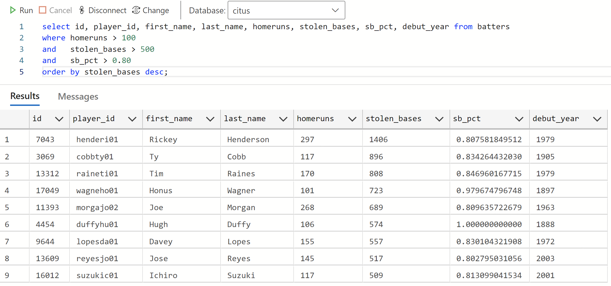

# Python Day Presentation

This page summarizes this repo as a **TL;DR**, or short presentation.

---

## About Chris Joakim

- Role
  - **Microsoft Cosmos DB Global Black Belt (GBB)**
- Location
  - Charlotte, NC, USA
- Career Path
  - Non-IT --> Software Developer --> Azure Cloud Solution Architect --> GBB
- Primary Languages
  - COBOL --> Smalltalk --> Java --> Ruby (RoR) --> Node.js (MEAN) --> Java --> **Python**
- Secondary Languages
  - Perl, Awk/Sed, Flex, Clojure, CoffeeScript, TypeScript, C#
- GitHub
  - https://github.com/cjoakim
  - https://github.com/cjoakim/azure-cosmos-db-vector-search-openai-python (this repo)
  - https://github.com/cjoakim/azure-cosmos-db-vector-search-openai-python/blob/main/docs/python_day.md (this presentation)
- PyPi Packages
  - [m26](https://pypi.org/project/m26/), [ggps](https://pypi.org/project/ggps/), [gdg](https://pypi.org/project/gdg/)

### Why Python now?

- Simplicity, pragmatic, universally used/understood, and wide range of use-cases
  - console apps, web apps, Docker, Spark (Synapse), ML/AML/AI, Azure Functions
  - Currently the defacto "Programming Language of Data Science" (IMO)

---

## This Presentation

- **Vector Search in Microsoft Azure** with:

  - [Azure OpenAI](https://learn.microsoft.com/en-us/azure/ai-services/openai/)
  - [Azure Cosmos DB NoSQL API](https://learn.microsoft.com/en-us/azure/cosmos-db/nosql/)
  - [Azure Cognitive Search](https://learn.microsoft.com/en-us/azure/search/)
  - The [Sean Lahman Baseball Database](http://seanlahman.com/download-baseball-database/) CSV files

#### Also in this Repo but not covered in this presentation

  - Azure PaaS Service Provisioning
  - Workstation Setup
  - Baseball Database CSV file "data wrangling" process
  - Vector Search with [Azure Cosmos DB Mongo vCore API](https://learn.microsoft.com/en-us/azure/cosmos-db/mongodb/vcore/)
  - Vector Search with [Azure Cosmos DB PostgreSQL API](https://learn.microsoft.com/en-us/azure/cosmos-db/postgresql/)
  - See the [README](README.md) where these topics are covered

### Also not covered in this presentation

  - The basics of [NoSQL](https://en.wikipedia.org/wiki/NoSQL) and [Cosmos DB](https://azure.microsoft.com/en-us/products/cosmos-db)

---

## What is Vectorization?

In this context, **vectorization** is the process of converting text data into vectors,
which are **one-dimensional arrays of scalar values**.

Think of them as a **numpy array of floats**.

These vectors are called **embeddings** in OpenAI.  The **OpenAI SDK** contains
the functionality to produce a vector, or an embedding, from text data.

### What does a Vector, or Embedding, look like?

This repo uses **OpenAI embeddings** which are **an array of 1536 floating-point values**.

```
[
    0.002035311423242092,
    -0.0016240125987678766,
    -0.00955343060195446,
    0.019685856997966766,
    -0.037366412580013275,
    0.02373882755637169,
    -0.016621416434645653,
    -0.006778487470000982,
    -0.031858891248703,
    -0.028865059837698936
    ...
    0.01938929781317711,
    -0.007039741612970829,
    0.0302207563072443,
    -0.005779366474598646,
    0.010683178901672363,
    0.00484026363119483,
    0.018556108698248863,
    -0.01864084042608738,
    -0.013634645380079746,
    -0.007526945322751999
]
```

## What is Vector Search?

- Searching a database, or search-engine, using vectors
- A vector is passed in as the query criteria
- The DB/engine matches rows/documents based on the given vector

### Can I use both standard search and vector search in my Azure Search Engine?

Yes.  But with different search syntax and parameters.


https://learn.microsoft.com/en-us/semantic-kernel/memories/vector-db


### Use-Cases for Vector Search

- Find images that are similar to a given image based on their visual content and style
- Find documents that are similar to a given document based on their topic and sentiment
- Find products that are similar to a given product based on their features and ratings

In short, any search use-case.


---

## What is Azure OpenAI, and why use it here?


---

## What's the Business Problem we're trying to solve?

While other search techniques can answer **simple searches** like:

- Who hits home runs at a similar rate as Hank Aaron?
- Who steals bases at at a similar rate as Rickey Henderson?
- Who has a similar pitching ERA (earned run average) as Ron Guidry?

**This project instead seeks to answer this more complex question, using vector search:**

- **Who has a similar OVERALL PERFORMANCE PROFILE as player x?**

This is more nuanced and subtle, and **can yield more relevant search results**.

### Example Baseball Player - Rickey Henderson

<p align="center">
    
</p>
<p align="center">
    Rickey Henderson (henderi01), MLB Hall of Fame Player, Statistical Unicorn
</p>

This simplistic SQL query (in Azure Cosmos DB PostgreSQL API) identifies a few
similar players.  But the **WHERE clause only contains three attributes** ...
it's not a **full-spectrun** query.

<p align="center">
    
</p>

#### But what if you're not in the baseball business?

This vector search solution is just an example;
it's easily modifiable for your use-cases.

---

## Step 1: Data Wrangling

- The data started as CSV from the Sean Lahman Baseball Database
- CSV rows were transformed into JSON documents
- JSON documents augmented with calculations
- JSON documents augmented with a **embeddings_str** value for vectorization

### Example Document for Hank Aaron 

```
  "aaronha01": {
    "playerID": "aaronha01",
    "birthYear": 1934,
    "birthCountry": "USA",
    "deathYear": "2021.0",
    "nameFirst": "Hank",
    "nameLast": "Aaron",
    "weight": 180,
    "height": 72,
    "bats": "R",
    "throws": "R",
    "debut": "1954-04-13",
    "finalGame": "1976-10-03",
    "teams": {
      "total_games": 3298,
      "teams": {
        "ML1": 1806,
        "ATL": 1270,
        "ML4": 222
      },
      "primary_team": "ML1"
    },
    "primary_position": "RF",
    "batting": {
      "G": "3298",
      "AB": "12364",
      "R": "2174",
      "H": "3771",
      "2B": "624",
      "3B": "98",
      "HR": "755",
      "RBI": "2297.0",
      "SB": "240.0",
      "CS": "73.0",
      "BB": "1402",
      "SO": "1383.0",
      "IBB": "293.0",
      "HBP": "32.0",
      "SF": "121.0",
      "calculated": {
        "runs_per_ab": 0.17583306373341961,
        "batting_avg": 0.30499838240051763,
        "2b_avg": 0.050469103849886766,
        "3b_avg": 0.007926237463604012,
        "hr_avg": 0.06106438045939825,
        "rbi_avg": 0.18578130054998382,
        "bb_avg": 0.11339372371400841,
        "so_avg": 0.11185700420575866,
        "ibb_avg": 0.023697832416693626,
        "hbp_avg": 0.002588159171789065
      }
    },
    "category": "fielder",
    "debut_year": 1954,
    "final_year": 1976,
    "embeddings_str": "fielder primary_position_rf total_games_3298 bats_r throws_r hits_3771 hr_755 batting_avg_305 runs_per_ab_176 2b_avg_50 3b_avg_8 hr_avg_61 rbi_avg_186 bb_avg_113 so_avg_112 ibb_avg_24 hbp_avg_3"
  }
```

I used the approach of creating **binned-text** values in the embeddings_str.
For example batting average of 0.30499838240051763 becomes "batting_avg_305".

A common example of this is T-shirt sizes - "S", "M", "L", "XL".

### Machine Learning "Features" vs Text Words

Since OpenAI embeddings calculation is based on **text**, the binned-text approach is used.

---

## Step 2: Vectorization


---

## Step 3: Loading the Azure Cosmos DB NoSQL API container


---

## Step 4: Configuring Azure Cognitive Search

---

## Step 5: Excuting Vector Searches vs Azure Cognitive Search


