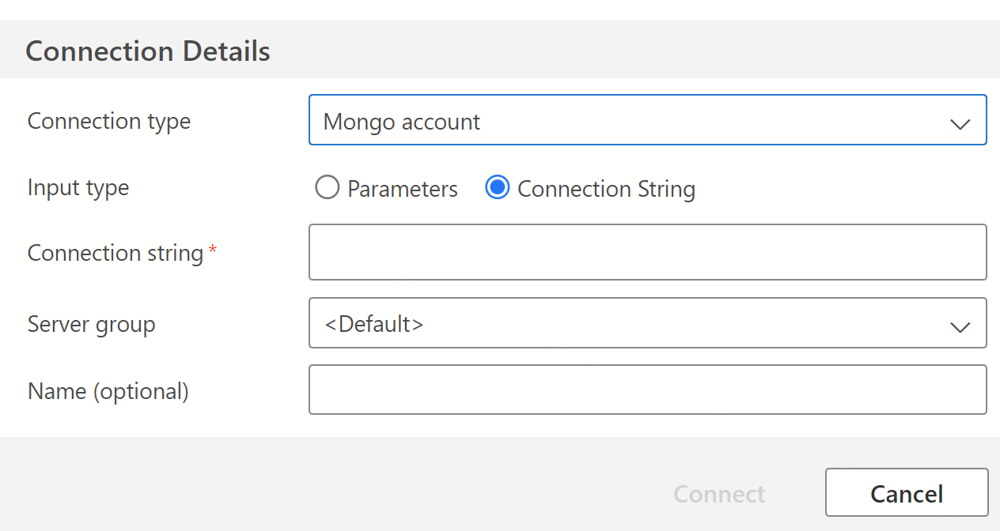
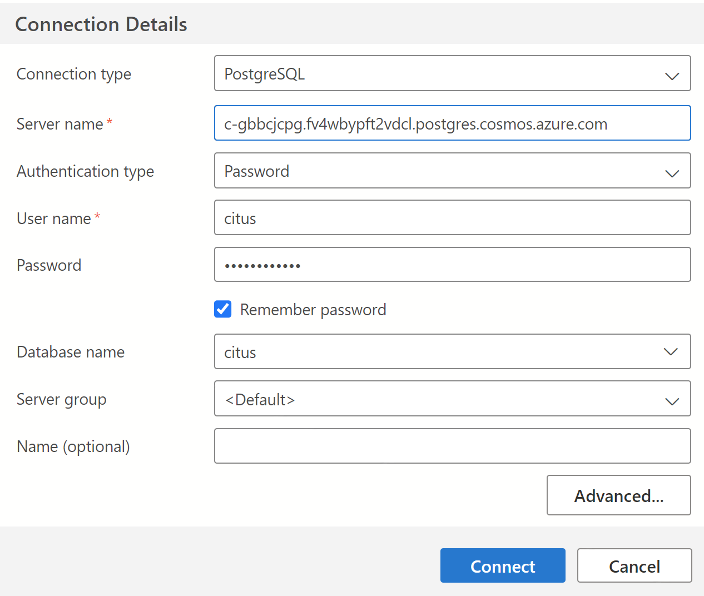
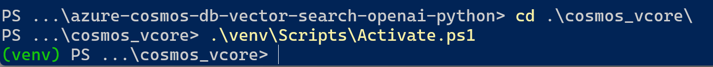
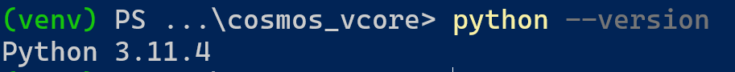

# Workstation Setup

Some software is required for this project, some is optional but recommended,
and some is additionally required based on which Cosmos DB API(s) you choose
to use.

## Required Software 

- Windows 11, macOS, or Linux operating system
- [git source control system](https://git-scm.com/downloads)
- [Python 3](https://www.python.org/downloads/)
  - This project developed and tested with standard Python, version 3.11.4
  - Legacy Python 2 will not work with this project
  - Anaconda or other Python distributions have not been tested
  - Please see the **Python Notes for new Users** section below
- PowerShell on Windows
- Terminal on macOS or Linux; bash shell assumed

## Recommended Software

- [Visual Studio Code (VSC)](https://code.visualstudio.com/) - text editor and IDE
- [PyCharm](https://www.jetbrains.com/pycharm/) - Python IDE for Developers

Note that both VSC and PyCharm support [GitHub CoPilot](https://github.com/features/copilot).

## Clone this GitHub Repository to your computer

```
> cd <some-parent-directory>
> git clone https://github.com/cjoakim/azure-cosmos-db-vector-search-openai-python.git
> cd azure-cosmos-db-vector-search-openai-python
> dir
```

You should then see the following directory structure for this project.
The directory names are self-explanatory.  The subproject related
to the Azure Cosmos DB for MongoDB vCore API, for example, is "cosmos_vcore".

```
Mode                 LastWriteTime         Length Name
----                 -------------         ------ ----
d-----          8/9/2023   5:12 PM                cognitive_search
d-----          8/7/2023   4:47 PM                cosmos_nosql
d-----          8/9/2023   3:22 PM                cosmos_pg
d-----          8/9/2023  12:22 PM                cosmos_vcore
d-----          8/7/2023   9:42 AM                data
d-----          8/7/2023   2:50 PM                data_wrangling
d-----          8/8/2023   9:21 AM                docs
-a----          8/7/2023   9:42 AM           3524 .gitignore
-a----          8/7/2023   9:42 AM           2965 backup.xml
-a----          8/7/2023   9:42 AM           1090 LICENSE
-a----          8/9/2023  11:02 AM           1019 README.md
```

---

## Additional Software

Additional software is required based on which Cosmos DB API(s)
you will use.

### Additional Software for MongoDB vCore API

- A **mongo shell program**, such as:
  - [Azure Data Studio (ADS)](https://azure.microsoft.com/en-us/products/data-studio)
    - See https://learn.microsoft.com/en-us/sql/azure-data-studio/quickstart-azure-cosmos-db-mongodb
  - [mongosh](https://www.mongodb.com/docs/mongodb-shell/) - the Mongo shell program
  - [Studio 3T](https://studio3t.com/)

**Azure Data Studio** is recommended.

#### Install the Azure Cosmos DB API for MongoDB extension

Please see this documentation page regarding installing this ADS extension:
https://learn.microsoft.com/en-us/sql/azure-data-studio/extensions/azure-cosmos-db-mongodb-extension?view=sql-server-ver16

After installing this extension you can create a connection to your vCore account
by simply pasting in your connection string, the value of environment variable
**AZURE_COSMOSDB_MONGO_VCORE_CONN_STR** described previously.


<p align="center">
    
</p>

### Additional Software for NoSQL API

No additional software is necessary.

### Additional Software for PostgreSQL API

- A **PostgreSQL client program**, such as:
  - [Azure Data Studio (ADS)](https://azure.microsoft.com/en-us/products/data-studio)
  - [pgAdmin](https://www.pgadmin.org/)
    - See https://learn.microsoft.com/en-us/azure/cosmos-db/postgresql/howto-connect?tabs=pgadmin
  - [psql](https://www.postgresql.org/docs/current/app-psql.html) - a terminal-based client
    - psql is installed as part of a local [PostgreSQL Installation](https://www.postgresql.org/download/)

**Azure Data Studio (ADS)** is recommended.

In ADS you can create a connection to your Azure Cosmos DB PostgreSQL API
account as shown in this screen-shot:

<p align="center">
    
</p>

---

## Python Notes for new Users

This section is intended to help new Python users be successful with this project.

The Python code in this repo is executed as a **command-line application**
(i.e. - console app), but the code itself is portable to running as a 
**Apache Spark Notebook** in an environment such as
[Azure Synapse Analytics](https://learn.microsoft.com/en-us/azure/synapse-analytics/)
or [Azure Machine Learning](https://learn.microsoft.com/en-us/azure/machine-learning/?view=azureml-api-2).

One technique I use to achieve Python code reuse is to keep my core set of code
in a private repository and then **"bundle"** this code into logical subsets for
use in various public projects like this.  These bundles are in file **pysrc/xxxbundle.py**,
in the several subprojects, where xxx is the name of the bundle.
These bundles can be copied verbatim into a cell of a Spark Notebook, if necessary.

In each subproject directory (cognitive_search, cosmos_nosql, cosmos_pg, cosmos_vcore, and data_wrangling)
there are scripts named **venv.ps1** and **venv.sh**.  These are used to create a
**python virtual environment** for each subproject.  A "python virtual environment",
or **venv**, is a python version **with an associated set of additional libraries**
that are installed to add necessary functionality.  You must run the appropriate
venv.ps1 (Windows) or venv.sh (macOS, Linux) script for each subproject you execute.
The venv scripts read a file named **requirements.in** which lists the set
of required libraries.  These are downloaded in the venv script by another python 
executable called **pip**.  The libraries are downloaded from [PyPI](https://www.pypy.org/).
After you create your python virtual environment you must **activate** it
in PowerShell or Terminal with the following commands:

```
.\venv\Scripts\Activate.ps1  <-- Windows
- or -
source venv/bin/activate     <-- macOS and Linux
```

The screen-shot below shows a virtual environment being activated.
Note that once activated, it changes the command-line prompt by adding
**(venv)** to it.

<p align="center">
    
</p>

It is critical that you're using Python 3 for this project, not Python 2.
You can check the version as follows:

<p align="center">
    
</p>

To see what libraries your venv is using, execute the **pip list** command:

```
(venv) PS ...\cosmos_vcore> pip list
Package                     Version
--------------------------- ---------
aiohttp                     3.8.5
aiosignal                   1.3.1
astroid                     2.15.6
async-timeout               4.0.2
attrs                       23.1.0
azure-ai-ml                 1.9.0
azure-common                1.1.28
azure-core                  1.28.0
azure-cosmos                4.4.0
azure-identity              1.13.0
azure-mgmt-core             1.4.0
azure-storage-blob          12.17.0
azure-storage-file-datalake 12.12.0
azure-storage-file-share    12.13.0
...
urllib3                     2.0.4
wheel                       0.41.1
wrapt                       1.15.0
yarl                        1.9.2
```

**Creating a python virtual environments will be a one-time activity for each subproject**
(data_wrangling, cosmosdb_vcore, etc).
After you create the venv, you subsequently only have to have to activate
it when you cd into the directory where it resides.

See [python.org](https://www.python.org/) to learn more about Python.

---

## Next

[Data Vectorization](data_vectorization.md)
